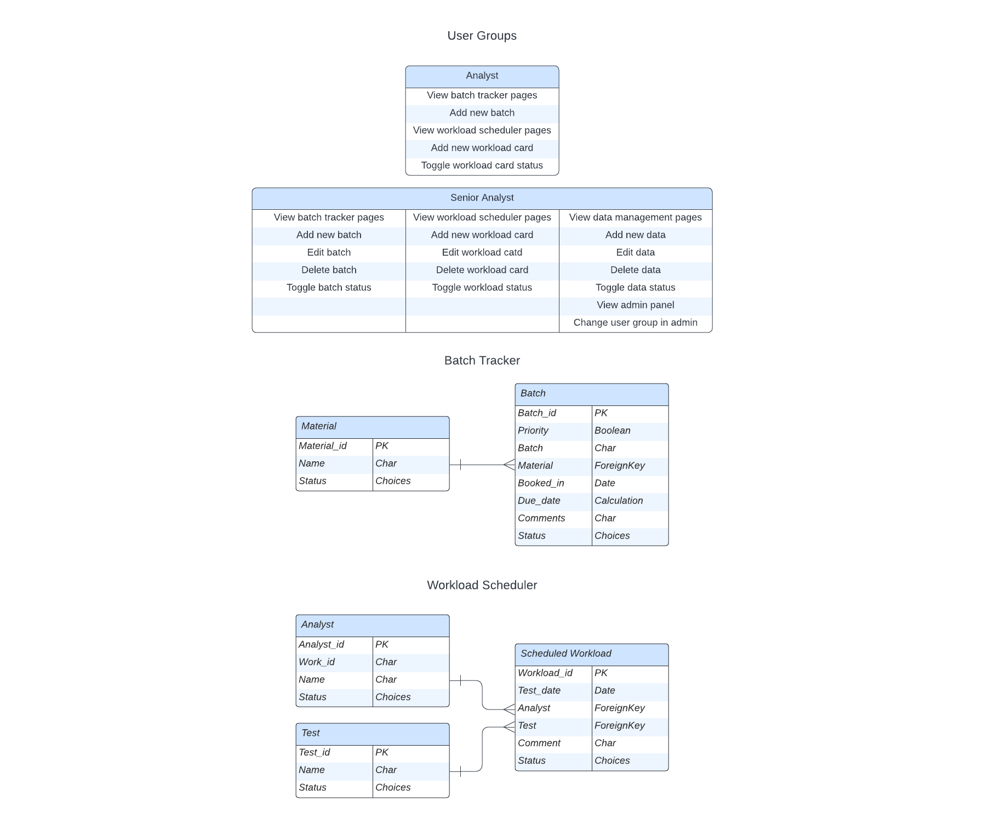
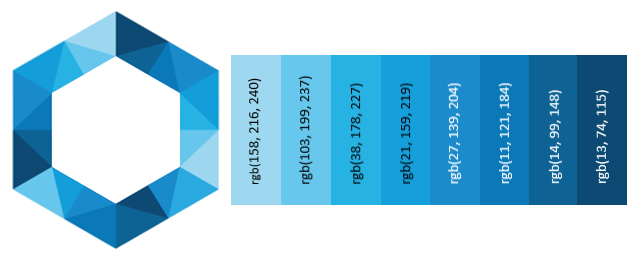

# <h1 align="center">**LAB BOSS**</h1>

## Introduction

Lab Boss is a laboratory planning tool and can be used by any laboratory team to make managing the workload easy and stress free. Lab Boss contains two apps, a batch tracker app and a scheduler app.

The batch tracker app allows the laboratory to track batches through the laboratory, easily seeing what batches require testing, when they are due and if they are a priority for the business.

The scheduler app allows the laboratory to schedule the workload by quickly and easily assigning an analytical test to an analyst on a particular day.

[View the live project here](https://lab-boss.herokuapp.com/)

## Table of Contents
  * [User Experience (UX)](#user-experience-ux)
  * [Data Model](#data-model)
  * [Agile Methodology](#agile-methodology)
  * [Design](#design)
  * [Features](#features)
  * [Languages and Libraries](#languages-and-libraries)
  * [Testing](#testing)
  * [Deployment](#deployment)
  * [Credits](#credits)

## User Experience (UX)

Lab Boss is a easy to use planning tool designed for use by a laboratory. There are two apps, a tracking tool that tracks batches through the laboratory and a scheduling tool that allows workload to be assigned to the team.

### User Stories

#### EPIC | User Admin
- As a Site User I can create an account so I can use the site.
- As a Site User I can log in or log out of my account so that I can keep my account secure.
- As a Site User I can only see any content without being logged in so that data is secure.
- As a Site User I can only see any content after my account has been authorised by an admin user so that control is maintained over the data.
- As a Site User I can only perform tasks appropriate to my role so that control is maintained over the data.
- As a Site User I receive success messages on completion of a task so that I am aware the changes I made were successful. 

#### EPIC | User Navigation
- As a Site User I can intuitively navigate around the site so that I can find content and understand where I am on the site.
- As a Site User I can view the contact information so that I can contact the site owner if required.

#### EPIC | Batch Tracker Use
- As a Site User I can see the batches that require testing so that the workload can be scheduled efficiently.
- As a Site User I can see which batches are priority so that they can be scheduled accordingly.
- As a Site User I can filter on fields for batches so that I can find a particular batch easily.
- As a Site User I can add a new batch onto the site through an easy-to-use interface so that the laboratory workload is up to date.

#### EPIC | Batch Tracker Management
- As a Senior Analyst I can approve batches so that that the laboratory workload is up to date.
- As a Senior Analyst I can edit or batches so that comments or changes can be made if required.
- As a Senior Analyst I can add, edit or delete materials so that changes can be made when required.

#### EPIC | Scheduler Use
- As a Site User I can view my workload cards so that I understand my work activities.
- As a Site User I can filter on fields for test_date, analyst or test so that I can find particular cards easily.
- As a Site User I can complete workload cards so that I can record my work as complete.
- As a Site User I can un-complete workload cards so that cards can be sent back to 'To Do' status if required.
- As a Site User I can create a new workload card through an easy-to-use interface so that work can be assigned.
- As a Site User I can edit testing cards so that the workload can be changed if required.

#### EPIC | Scheduler Management
- As a Senior Analyst I can delete testing cards so that the workload can be changed if required.
- As a Senior Analyst I can view, add, edit or delete analysts so that changes can be made when required.
- As a Senior Analyst I can add, edit or delete tests so that changes can be made when required.

[Table Of Contents](#table-of-contents)

## Data Model

Django’s Class-Based Generic Views  and Object-Oriented Programming princliples were used throughout this project.

Custom models were generated for this project:

Tracker app:
- Materials
- Batch

Scheduler:
- Analysts
- Tests
- Workload

Django AllAuth was used for the user authentication system.

The diagram below details the Database Entity Relationship Diagram:

[Table Of Contents](#table-of-contents)

## Agile Methodology

An agile approach was implemented for the project using GitHub projects where the Epics were added as Milestones and allocated the User Stories as Issues. Each User Story Issue was given acceptance criteria and tasks to assist in the completion of each Issue.

The project board was also used to track development tasks and backlog issues (PBIs).

The project board can be viewed [here](https://github.com/users/Porsil/projects/6)

[Table Of Contents](#table-of-contents)

## Design

The site was designed to have a simple and professional look. The site was designed to have a clean and clinical look as the site would be used inside a laboratory setting.

### Fonts

Manrope was used as the font for the body of the site and Russo One was used for the headings. In case the fonts do not import into the website correctly, Sans Serif was used as the backup font.

### Colour Scheme

The colours for the site were taken from the logo using the Google Chrome Eye Dropper extension:

### Imagery

To keep the site looking professional, only one image was used on the pages that did not contain much text. The image used is of test tubes containing a blue liquid to keep in theme of the site.

### Wireframes

Home

Batch Tracker

Scheduler

Add Batch

Materials

Add/Edit Material

Analysts

Tests

Add/Edit Test

Contact Us

[Table Of Contents](#table-of-contents)

## Features

[Table Of Contents](#table-of-contents)

## Languages and Libraries

[Table Of Contents](#table-of-contents)

## Testing

Testing details and results can be found [here](/TESTING.md).

[Table Of Contents](#table-of-contents)

## Deployment

[Table Of Contents](#table-of-contents)

## Credits

[Table Of Contents](#table-of-contents)
