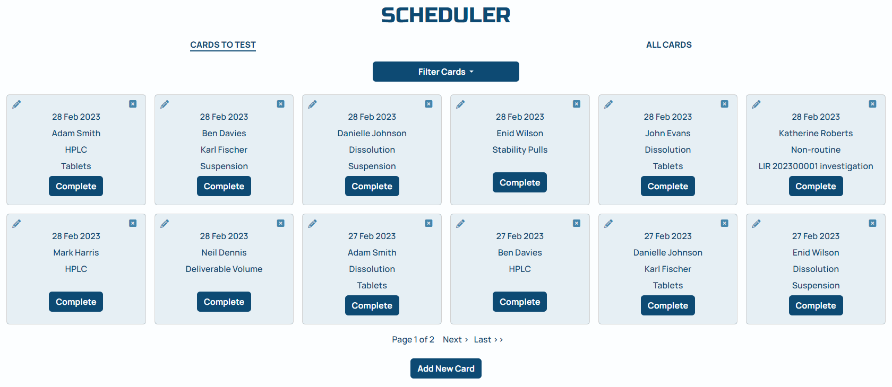
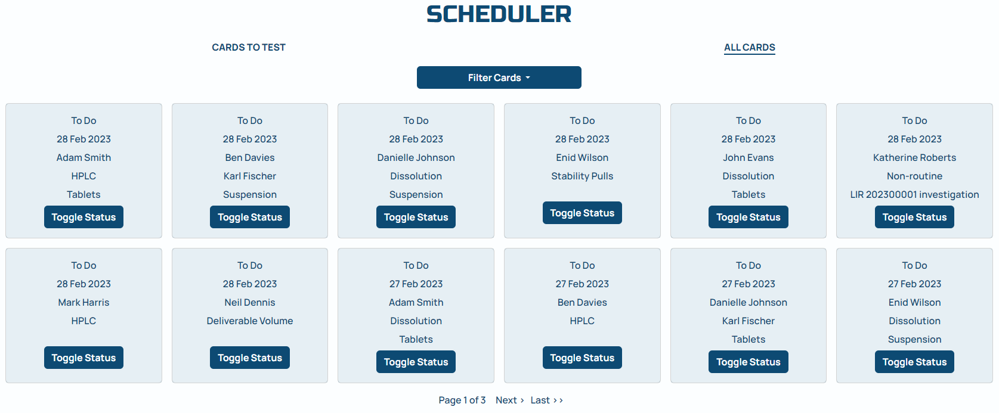

# <h1 align="center">**LAB BOSS**</h1>

## Introduction

Lab Boss is a laboratory planning tool and can be used by any laboratory team to make managing the workload easy and stress free. Lab Boss contains two apps, a batch tracker app and a scheduler app.

The batch tracker app allows the laboratory to track batches through the laboratory, easily seeing what batches require testing, when they are due and if they are a priority for the business.

The scheduler app allows the laboratory to schedule the workload by quickly and easily assigning an analytical test to an analyst on a particular day.

[View the live project here](https://lab-boss.herokuapp.com/)

## Table of Contents
  * [User Experience (UX)](#user-experience-ux)
  * [Data Model](#data-model)
  * [Agile Methodology](#agile-methodology)
  * [Design](#design)
  * [Security](#security)
  * [Features](#features)
  * [Languages and Libraries](#languages-and-libraries)
  * [Testing](#testing)
  * [Deployment](#deployment)
  * [Credits](#credits)

## User Experience (UX)

Lab Boss is a easy to use planning tool designed for use by a laboratory. There are two apps, a tracking tool that tracks batches through the laboratory and a scheduling tool that allows workload to be assigned to the team.

### User Stories

#### EPIC | User Admin
- As a Site User I can create an account so I can use the site.
- As a Site User I can log in or log out of my account so that I can keep my account secure.
- As a Site User I can only see any content without being logged in so that data is secure.
- As a Site User I can only see any content after my account has been authorised by an admin user so that control is maintained over the data.
- As a Site User I can only perform tasks appropriate to my role so that control is maintained over the data.
- As a Site User I receive success messages on completion of a task so that I am aware the changes I made were successful. 

#### EPIC | User Navigation
- As a Site User I can intuitively navigate around the site so that I can find content and understand where I am on the site.
- As a Site User I can view the contact information so that I can contact the site owner if required.

#### EPIC | Batch Tracker Use
- As a Site User I can see the batches that require testing so that the workload can be scheduled efficiently.
- As a Site User I can see which batches are priority so that they can be scheduled accordingly.
- As a Site User I can filter on fields for batches so that I can find a particular batch easily.
- As a Site User I can add a new batch onto the site through an easy-to-use interface so that the laboratory workload is up to date.

#### EPIC | Batch Tracker Management
- As a Senior Analyst I can approve batches so that that the laboratory workload is up to date.
- As a Senior Analyst I can edit or batches so that comments or changes can be made if required.
- As a Senior Analyst I can add, edit or delete materials so that changes can be made when required.

#### EPIC | Scheduler Use
- As a Site User I can view my workload cards so that I understand my work activities.
- As a Site User I can filter on fields for test_date, analyst or test so that I can find particular cards easily.
- As a Site User I can complete workload cards so that I can record my work as complete.
- As a Site User I can un-complete workload cards so that cards can be sent back to 'To Do' status if required.
- As a Site User I can create a new workload card through an easy-to-use interface so that work can be assigned.
- As a Site User I can edit testing cards so that the workload can be changed if required.

#### EPIC | Scheduler Management
- As a Senior Analyst I can delete testing cards so that the workload can be changed if required.
- As a Senior Analyst I can view, add, edit or delete analysts so that changes can be made when required.
- As a Senior Analyst I can add, edit or delete tests so that changes can be made when required.

[Table Of Contents](#table-of-contents)

## Data Model

Django’s Class-Based Generic Views  and Object-Oriented Programming princliples were used throughout this project.

Custom models were generated for this project:

Tracker app:
- The material model is used to create a custom list of the different materials or products the laboratory tests.
- The batch model is used to create details of a specific batch that has been received in the laboratory for testing. It uses the material model as a foreign key as a particular batch can only have 1 material.

Scheduler:
- The analyst model is used to create a custom list of analyst who perform testing in the laboratory. The user model was not used as not all users would be performing testing e.g. managers.
- The test model is used to create a custom list of testing that is performed in the laboratory.
- The workload model used both the analyst and test model and foreign keys to produce workload cards. These are designed to inform the analysts what tests they are performing on a certain day. 

Django AllAuth was used for the user authentication system.

The diagram below details the Database Entity Relationship Diagram:

[Table Of Contents](#table-of-contents)

## Agile Methodology

An agile approach was implemented for the project using GitHub projects where the Epics were added as Milestones and allocated the User Stories as Issues. Each User Story Issue was given acceptance criteria and tasks to assist in the completion of each Issue.

The project board was also used to track development tasks and backlog issues (PBIs).

The project board can be viewed [here](https://github.com/users/Porsil/projects/6)

### Product Backlog Issues

Priority Field

- The priority checkbox field on the add batch and edit batch forms is not central. This issue is cosmetic only and does not impact the use of the site. This PBI was not completed due to time constraints.

My Cards

- The original scheduler plan was to have an link that when clicked would display just the user's cards. This was not implemented due to time constraints. User's can easily find their cards by using the filter options on both scheduler pages. 

[Table Of Contents](#table-of-contents)

## Design

The site was designed to have a simple and professional look. The site was designed to have a clean and clinical look as the site would be used inside a laboratory setting.

### Fonts

Manrope was used as the font for the body of the site and Russo One was used for the headings. In case the fonts do not import into the website correctly, Sans Serif was used as the backup font.

### Colour Scheme

The colours for the site were taken from the logo using the Google Chrome Eye Dropper extension:

### Imagery

To keep the site looking professional, only one image was used on the pages that did not contain much text. The image used is of test tubes containing a blue liquid to keep in theme of the site.

### Wireframes

Home

Batch Tracker

Scheduler

Add Batch

Materials

Add/Edit Material

Analysts

Tests

Add/Edit Test

Contact Us

[Table Of Contents](#table-of-contents)

## Security

### User Access and Authentication

Two User group's were set up using the Django Administration Panel, Analyst and Senior Analyst, these groups were assigned permissions appropriate to the role.

The site makes use of these Admin User Groups along with Django's Admin LoginRequiredMixin and PermissionRequiredMixin to ensure user's can only see and use features appropriate to their role.

New user's are not able to see or access the site feature's until they have been assigned to a role by a senior analyst, and are informed of this upon registration.

If the user attemps to access a feature not apropriate to their role, they are shown a HTTP 403 Forbidden Error.

### Secret Keys

To prevent unwanted connections the DATABASR_URL, SECRET_KEY and CLOUDINARY_URL are stored in the env.py, which is listed in the .gitignore file. This was done before the initial commit to GitHub.

### Forms

To prevent attack, Cross-Site Request Forgery (CSRF) tokens are used on all forms in the site.

[Table Of Contents](#table-of-contents)

## Features

Header

### Logo

- A custom logo was created for the site. It was created by me by using Micrsoft Word to add the app name to this hexagon from [Freepik](https://www.freepik.com/free-vector/polygonal-hexagon-logo_1112748.htm#page=2&query=hexagon&position=31&from_view=search&track=sph). The background was then removed from the image using [Photoroom](https://www.photoroom.com/background-remover/).
- The logo is positioned in the top left of the header on all site pages, and serves as a link back to the home page.

### Navigation Bar

- The navigation bar is visible on all site pages and provides easy links to other areas of the site.
- When a link is hovered over the text colour changes to provide a visual cue to the user.
- When the screen size is reduced the navigation bar collapses into a hamburger menu:

- The navigation bar visible to the user is dependant on the user's status, so only links to pages they have access to are listed:
  - When the user is logged out, they have the options to Login or Register:

  

  - When a user is logged in that has not had their account authorised yet, they only have the option to Logout:

  

  - When a user belonging to the analyst group is logged in, they have the options to visit the Batch Tracker page, Scheduler page or Logout:

  

  - When a user belonging to the senior analyst group is logged in, they have the options to visit the Batch Tracker page, Scheduler page or Logout. A dropdown menu is also available to visit the Data Management pages of Materials page, Analsysts page, Tests page or the Admin panel:

  

Footer

- The footer contains a link to the contact us page. As the site is degined for professional use, social media links have not been added.

Home Page

- The home page serves as a central hub containing and contains options for the user dependant of their status:
  - When the user is logged out, they have the options to Login or Register:

  

  - When a user is logged in that has not had their account authorised yet, they are informed of why they cannot access the site yet:

  

  - When a user belonging to eiher the analyst or senior analyst group is logged in, they have the options to visit the Batch Tracker page or the Scheduler page:

  

User Account Pages

- Django AllAuth was used to create the account login and register forms.
- When the user clicks Logout they are asked if they are sure they want to Signout incase the logout link was pressed in error.
- Success messages provide feedback to the user on successfull login or logout.
  - Login Page:

  

  - Register Page:

  

  - Logout Confirmation Page:

  
  

Batch Tracker

- The Batch Tracker allows the laboratory to track the batches received by the laboratory. This allows the user's to see what batches require testing, if they are a priority and the due date for approval, helping to plan workload so batches can be approved before their due date and ensure all batches have been approved.
- The Batch Tracker contains 3 sections:
  - Priority batches to test
  - Batches under test
  - All batches
- The priority batches page contains a table to view all the batches marked as priority with the status under test and is available to users from both the analyst and senior analyst groups.

- The batches under test page contains a table to view all the batches with the status under test and is available to view for users from both the analyst and senior analyst groups. The analyst view is shown below.

- From the batches under test page a new batch can be added by both user groups by clicking the Add New Batch button at the bottom of the page, this opens the Add New Batch form.

 

- In the batches under test page, users from the senior analyst group have additional view options to change the batch status, edit a batch or delete a batch. The batch status can be changed from To Test to Approved by clicking on the tick icon in the Status column.

- From the batches under test page a batch can be edited by users from the senior analyst group by clcking the pencil icon in the Edit column, this opens the Edit Batch form. 

- From the batches under test page a batch can be deleted by users from the senior analyst group by clicking the cross icon in the delete column, this opens a confirmation page to prevent accidental deletion.

- The all batches page contains a list of all batches, regardless of status and is available to view for users from both the analyst and senior analyst groups. The analyst view is shown below.

- In the all batches page, users from the senior analyst group have an additional view option to toggle the batch status. The batch status can be toggled betwwen To Test and Approved by clicking on the toggle icon in the Status column. This allows batches that have been approved in error to be changed back to a To Test status.

- The all batches page contains filter options that are available to users from both the analyst and senior analyst groups. This allows the user to search the table for specific criteria.

- A success message is displayed on successful approval, add, edit, delete or toggle of a batch.

Workload Scheduler

- The Scheduler allows the laboratory to orgainse the laboratory workload. In this section of the site cards are created that assign an analyst to an analytical test on a specific day. This allows analysts to easily see what work is required of them, and once the testing is complete, the card can be set to completed to acknowledge the completion of the work.
- The Scheduler contains 2 sections:
  - Cards to test
  - All cards
- The cards to test page contains all the cards with the status To Do and is available to view for users from both the analyst and senior analyst groups. Cards are marked as complete by clicking the Complete button on the card. The analyst view is shown below.

- From the cards to test page a new card can be added by both user groups by clicking the Add New Card button at the bottom of the page, this opens the Add New Card form.

- From the cards to test page a card can be edited by both user groups by clcking the pencil icon in the top left corner of the card, this opens the Edit Card form. 

- In the cards to test page, users from the senior analyst group have additional view options to delete a card.

- From the cards to test page a batch can be deleted by users from the senior analyst group by clicking the cross icon in the top right corner of the card, this opens a confirmation page to prevent accidental deletion.

- The card to test page contains filter options that are available to users from both the analyst and senior analyst groups. This allows the user to search the cards for specific criteria.

- The all cards page contains a list of all cards, regardless of status and is available to view for users from both the analyst and senior analyst groups. The cards with a status of Completed have the text crossed through to make it easier to distinguish between the two statuses. The analyst view is shown below.

- In the all cards page, users from the senior analyst group have additional view options to delete a card.

- From the all cards page a batch can be deleted by users from the senior analyst group by clicking the cross icon in the top right corner of the card, this opens a confirmation page to prevent accidental deletion.

- The all cards page contains filter options that are available to users from both the analyst and senior analyst groups. This allows the user to search the cards for specific criteria.

- A success message is displayed on successful completion, add, edit, delete or toggle of a card.

Materials

- The materials page is part of the Data Management of the site content and can only be accessed by a user belonging to the Senior Analyst group.
- This page displays all the materials that a batch received into the laboratory could be.
- The table is paginated after 15 rows.
- The status of a material can be toggled by clicking the toggle switch in the Status column.

- A new material can be added by clicking the Add New Material button at the bottom of the page, this opens the Add New Material form.

- A material can be edited by clcking the pencil icon in the Edit column, this opens the Edit Material form.

- A material can be deleted by clicking the cross icon in the delete column, this opens a confirmation page to prevent accidental deletion.

- A success message is displayed on successful toggle, add, edit or delete of a material.

Analysts

- The analysts page is part of the Data Management of the site content and can only be accessed by a user belonging to the Senior Analyst group.
- This page displays all the analysts that perform analytical testing in the laboratory.
- The table is paginated after 15 rows.
- The status of an analyst can be toggled by clicking the toggle switch in the Status column.

- A new analsyt can be added by clicking the Add New Analyst button at the bottom of the page, this opens the Add New Analyst form.

- An analyst can be edited by clcking the pencil icon in the Edit column, this opens the Edit Analyst form.

- An analyst can be deleted by clicking the cross icon in the delete column, this opens a confirmation page to prevent accidental deletion.

- A success message is displayed on successful toggle, add, edit or delete of an analyst.

Tests

- The tests page is part of the Data Management of the site content and can only be accessed by a user belonging to the Senior Analyst group.
- This page displays all the analytical tests that are performed in the laboratory.
- The table is paginated after 15 rows.
- The status of a test can be toggled by clicking the toggle switch in the Status column.

- A new test can be added by clicking the Add New Test button at the bottom of the page, this opens the Add New Test form.

- A test can be edited by clcking the pencil icon in the Edit column, this opens the Edit Test form.

- A test can be deleted by clicking the cross icon in the delete column, this opens a confirmation page to prevent accidental deletion.

- A success message is displayed on successful toggle, add, edit or delete of a test.

Contact Us

- The contact us page provides user's with the information on how to contact Lab Boss.
- The user can easily return to the Home page with the Home button.

[Table Of Contents](#table-of-contents)

## Languages and Libraries

### Languages Used

- HTML
- CSS
- JavaScript
- Python

### Frameworks, Libraries & Programs Used

- [Django](https://www.djangoproject.com/) was used as the main python framework.
- [Django-allauth](https://django-allauth.readthedocs.io/en/latest/installation.html) was used to for account management.
- [Django-filer](https://django-filter.readthedocs.io/en/stable/) was used to create the filters on the site.
- [PostgreSQL](https://www.postgresql.org/) was used to host the database.
- [Cloudinary](https://cloudinary.com/) used to host images and static files.
- [Heroku](https://dashboard.heroku.com/login) was used to deploy the site.
- [Gitpod](https://gitpod.io/) was used for version control and agile methodology.
- [Bootstrap](https://getbootstrap.com/docs/5.3/getting-started/introduction/) was used as a frontend toolkit to aid in the sites styling and responsiveness.
- [Crispy Forms](https://django-crispy-forms.readthedocs.io/en/latest/) was used to create the Django Forms.
- [Google Fonts](https://fonts.google.com/) was used to import the fonts used on the site.
- [Font Awesome](https://fontawesome.com/) was used for the approve, toggle, edit and delete icons used accross the site.
- [Chrome Developer Tools](https://developer.chrome.com/docs/devtools/) was used through the project for inspecting and testing the site.
- [Balsamiq](https://balsamiq.com/) was used to create the wireframe for the website.
- [Lucidchart](https://www.lucidchart.com/pages/) was used to create the database entity relationship diagram.
- The logo was created by adapting this [Freepik](https://www.freepik.com/free-vector/polygonal-hexagon-logo_1112748.htm#page=2&query=hexagon&position=31&from_view=search&track=sph) image. 
- Microsoft Word was used to create the logo image.
- [Photoroom](https://www.photoroom.com/background-remover/) was used to remove the background from the logo image.
- [Ezgif](https://ezgif.com) was used to convert images to webp format.
- [Am I Responsive](https://ui.dev/amiresponsive) was used to create the site mock-up image.

[Table Of Contents](#table-of-contents)

## Testing

Testing details and results can be found [here](/TESTING.md).

[Table Of Contents](#table-of-contents)

## Deployment

To deploy this app to Heroku from its GitHub repository:

### File setup prior to deployment:
- Ensure all secret keys are stored in an env.py file and this is listed in the .gitignore file. Any keys that have been previously commited to GitHub should be changed for security purposes.
- Ensure requirements.txt file is up to date by using 'pip3 freeze --local > requirements.txt' in the command terminal.
- Ensure a Procfile is present and contains the code 'web: gunicorn labboss.wsgi'.
- Ensure in settings.py DEBUG = False
- Ensure the code is commited and pushed to GitHub.

### Create a Heroku App:
- Log in to [Heroku](https://dashboard.heroku.com/apps). If required, create an account.
- Click the 'New' button in the top right and select 'Create new app' from the drop-down menu.
- Enter a name for the app in the 'App name' field, this must be an unique and should be meaningful to the app's content.
- Select your region in the 'Choose a region' field.
- Click on the 'Create app' button.

### Add Heroku Config Vars:
- In Heroku click on the 'Settings' tab and scroll down to the 'Config Vars' section. Add the following Config Vars:
  - CLOUDINARY_URL
  - DATABASE_URL
  - SECRET_KEY
  - PORT: 8000

### Deploy in Heroku
- In Heroku click on the 'Deploy' tab and scroll down to the 'Deployment Method' section. Select 'GitHub' and confirm you wish to deploy using GitHub. Enter your GitHub password if prompted.
- Scroll to the 'Connect to GitHub' section and search for your repository.
- Click 'Connect' when found.
- To deploy:
  - Option 1 - To automatically redeploy your app every time you push changes to GitHub: In the 'Automatic deploys' section add the 'main' branch to 'Choose a branch to deploy' field and click 'Enable Automatic Deploys'.
  - Option 2 - To manually deploy your site: In the 'Manual Deploy' section add the 'main' branch to 'Choose a branch to deploy' field and click 'Deploy Branch'.
- The app is now live, click 'View' to view the deployed site.

## Forking the repository
- Open the [Lab Boss](https://github.com/Porsil/lab-boss) repository.
- Click the 'Fork' button in the top right.
- This creates a copy of the repository.

## Cloning the repository
- Open the [Lab Boss](https://github.com/Porsil/lab-boss) repository.
- Click the green '<> Code' button. Select the prefered cloning option from the list then copy the link provided.
- Change the current working directory to the location where you want the cloned directory.
- Type 'git clone' and paste the URL you copied earlier.
- Press 'Enter' to create your local clone.

[Table Of Contents](#table-of-contents)

## Credits

- The code to import the fonts was taken from [Google Fonts](https://fonts.google.com/).
- The code to add the icons used was taken from [Font Awesome](https://fontawesome.com/).
- The code to create the zebra stripes in the batch tracker table was adapred from [W3Schools](https://www.w3schools.com/html/html_table_styling.asp).
- The code to change the date format used on the site was taken from this [Django Documentation](https://docs.djangoproject.com/en/4.1/ref/templates/builtins/#date).
- The following Geeks for Geeks sites were used to aid in creating all class based [Create Views](https://www.geeksforgeeks.org/createview-class-based-views-django/), [Update Views](https://www.geeksforgeeks.org/updateview-class-based-views-django/) and [Delete Views](https://www.geeksforgeeks.org/deleteview-class-based-views-django/).
- The code to stop the footer overlaying with the page content was adapted from this [CodeHim page](https://www.codehim.com/bootstrap/bootstrap-5-footer-always-at-bottom/).
- The code to create a message on the delete views was taken from this [Stackoverflow page](https://stackoverflow.com/questions/24822509/success-message-in-deleteview-not-shown).
- The code to allow filters and pagination to work together was taken from this [CaktusGroup page](https://www.caktusgroup.com/blog/2018/10/18/filtering-and-pagination-django/).
- Various documentation sites were used throughout the project including [Django Docs](), [Django Filter Docs](), [Django Authentication](https://docs.djangoproject.com/en/4.1/topics/auth/default/), [Django Messages](https://docs.djangoproject.com/en/4.1/ref/contrib/messages/) and [Bootstrap](https://getbootstrap.com/docs/5.3/getting-started/introduction/).
- Various code was taken from the [Code Institute - Blog Walkthrough Project](https://github.com/Code-Institute-Solutions/Django3blog).

[Table Of Contents](#table-of-contents)

## Acknowledgements

My Mentor Narender Singh for their knowledge and feedback.