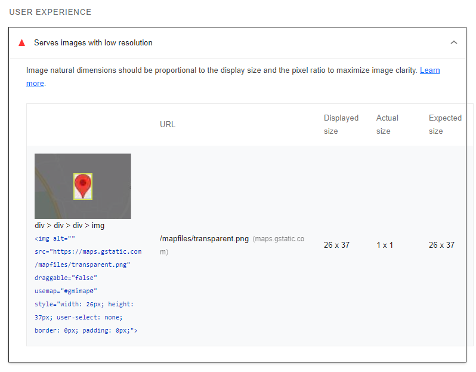

# Table of Contents
- [Validator Testing](#validator-testing)
  * [HTML](#html)
  * [CSS](#css)
  * [JavaScript](#javascript)
  * [Python](#python)
  * [Lighthouse](#lighthouse)
- [Browser and Device Testing](#browser-and-device-testing)
- [Manual Testing](#manual-testing)
- [Bugs](#bugs)

# Validator Testing

## HTML

The [Official W3C HTML Validator](https://validator.w3.org/) was used to check all html pages. All errors found were fixed.

HTML Validation Report

| Page                     | Logged Out    | Logged In - Analyst | Logged In - Senior |
|--------------------------|:-------------:|:-------------------:|:------------------:|
| login.html               | Note 1        | N/A                 | N/A                |
| logout.html              | N/A           | Note 1              | Note 1             |
| signup.html              | Note 1        | N/A                 | N/A                |
| 400.html                 | Note 2 & 3    | N/A                 | N/A                |
| 403.html                 | N/A           | Note 3              | Note 3             |
| 404.html                 | Note 3        | N/A                 | N/A                |
| 500.html                 | Note 3        | N/A                 | N/A                |
| base.html                | Note 1        | Note 1              | Note 1             |
| index.html               | No errors     | No errors           | No errors          |
| contact_us.html          | No errors     | No errors           | No errors          |
| tracker.html             | N/A           | No errors           | No errors          |
| all_tracker.html         | N/A           | No errors           | No errors          |
| priority_tracker.html    | N/A           | No errors           | No errors          |
| add_batch.html           | N/A           | No errors           | No errors          |
| update_batch.html        | N/A           | N/A                 | No errors          |
| delete_batch.html        | N/A           | N/A                 | No errors          |
| material.html            | N/A           | N/A                 | No errors          |
| add_material.html        | N/A           | N/A                 | No errors          |
| update_material.html     | N/A           | N/A                 | No errors          |
| delete_material.html     | N/A           | N/A                 | No errors          |
| scheduler.html           | N/A           | Note 4              | Note 4             |
| all_scheduler.html       | N/A           | Note 4 & 5          | Note 4 & 5         |
| add_workload.html        | N/A           | No errors           | No errors          |
| update_workload.html     | N/A           | No errors           | No errors          |
| delete_workload.html     | N/A           | N/A                 | No errors          |
| all_delete_workload.html | N/A           | N/A                 | No errors          |
| analysts.html            | N/A           | N/A                 | No errors          |
| add_analyst.html         | N/A           | N/A                 | No errors          |
| update_analyst.html      | N/A           | N/A                 | No errors          |
| delete_analyst.html      | N/A           | N/A                 | No errors          |
| tests.html               | N/A           | N/A                 | No errors          |
| add_test.html            | N/A           | N/A                 | No errors          |
| update_test.html         | N/A           | N/A                 | No errors          |
| delete_test.html         | N/A           | N/A                 | No errors          |

HTML Validation Notes

### Notes

- Note 1:
login.html, logout.html, signup.html and base.html all had a trailing slash.
The trailing slash was removed to fix the error.

- Note 2:
400.html had an extra `
` that was not required.
This was removed to fix the error.

- Note 3:
All 4 error pages had the heading of `<h3>Lab Boss</h1>`.
The closing tag was changed to `</h3>` to fix the error.

- Note 4:
The icon links and toggle card form were enclosed in `

` tags.
The `

` tags were changed to `

` tags to fix the error.

- Note 5:
Page contained `<strike></strike>` tags, which are obsolete.
To fix the error these tags were removed and CSS was added to line through the required text.

[Table Of Contents](#table-of-contents)

## CSS

The [Official W3C CSS Validator](https://jigsaw.w3.org/css-validator/) was used to check the style.css file. No errors were found.

CSS Validation Report

[Table Of Contents](#table-of-contents)

## JavaScript

[Jshint](https://jshint.com/) was used to check all JavaScript code. No errors were found.

Jshint Reports

[Table Of Contents](#table-of-contents)

## Python

The python code was checked using the PEP8 linter throughout the project. The linter detected numerous issues with the code relating to whitespace and lines being too long. These issues were fixed by deleting any whitespaces and changing the long lines to multi-line code. Any code flagged for these issues that was not written by me has not been changed.

[Table Of Contents](#table-of-contents)

## Lighthouse

All pages were run for Lighthouse validation on both desktop and mobile to assess performance and accessibility. Initial reports gave the images should be in webp format and 'aria-labels' were missing for icon buttons. These were fixed by converting the images to webp format and adding aria-labels to the icon buttons.
The Lighthouse report gave give a warning for *'Background and foreground colors do not have a sufficient contrast ratio'*, the contrast was improved on the home page and the tracker table. This issue was ignored for the footer link to the logo attribute as the link is not an integral part of the site but a requirement for use of the logo hexagon.

After the updates given above the following scores were given:

Lighthouse Desktop Report

| Page                | Performance  | Accessibility | Best Practices  | SEO  |
|---------------------|:------------:|:-------------:|:---------------:|:----:|
| login               | 99           | 97            | 100             | 100  |
| logout              | 99           | 98            | 100             | 100  |
| signup              | 99           | 97            | 100             | 100  |
| home                | 99           | 97            | 100             | 100  |
| contact_us          | 99           | 98            | 92 (Note 6)     | 100  |
| tracker             | 99           | 98            | 100             | 100  |
| all_tracker         | 98           | 98            | 100             | 100  |
| priority_tracker    | 99           | 98            | 100             | 100  |
| add_batch           | 98           | 98            | 100             | 100  |
| update_batch        | 98           | 98            | 100             | 100  |
| delete_batch        | 98           | 98            | 100             | 100  |
| material            | 99           | 98            | 100             | 100  |
| add_material        | 98           | 98            | 100             | 100  |
| update_material     | 98           | 98            | 100             | 100  |
| delete_material     | 98           | 98            | 100             | 100  |
| scheduler           | 98           | 98            | 100             | 100  |
| all_scheduler       | 98           | 98            | 100             | 100  |
| add_workload        | 98           | 98            | 100             | 100  |
| update_workload     | 98           | 98            | 100             | 100  |
| delete_workload     | 98           | 98            | 100             | 100  |
| all_delete_workload | 98           | 98            | 100             | 100  |
| analysts            | 99           | 98            | 100             | 100  |
| add_analyst         | 99           | 98            | 100             | 100  |
| update_analyst      | 98           | 98            | 100             | 100  |
| delete_analyst      | 98           | 98            | 100             | 100  |
| tests               | 99           | 98            | 100             | 100  |
| add_test            | 98           | 98            | 100             | 100  |
| update_test         | 98           | 98            | 100             | 100  |
| delete_test         | 98           | 98            | 100             | 100  |

- Note 6:
The Lightouse best practies score was lower for the contact us page due to the map pin. This was ignored as the map was generated using an API.

Lighthouse Mobile Report

Due to the site being desiged for use in a laboratory, it is unlikely to be used on a mobile device. The mobile report was performed as site has been designed to be responsive so the browser size can be shrunk if desired.

The main issue reported for mobile devices was the font size of the logo attribute text and the copyright text in the footer are too small. This issue was not addressed due to these not being an integral part of the sites usage.

| Page                | Performance  | Accessibility | Best Practices  | SEO  |
|---------------------|:------------:|:-------------:|:---------------:|:----:|
| login               | 88           | 97            | 100             | 98   |
| logout              | 88           | 97            | 100             | 92   |
| signup              | 89           | 97            | 100             | 92   |
| home                | 94           | 98            | 100             | 92   |
| contact_us          | 85           | 98            | 92              | 92   |
| tracker             | 91           | 97            | 100             | 95   |
| all_tracker         | 91           | 97            | 100             | 97   |
| priority_tracker    | 94           | 97            | 100             | 95   |
| add_batch           | 88           | 97            | 100             | 92   |
| update_batch        | 88           | 97            | 100             | 92   |
| delete_batch        | 88           | 97            | 100             | 100  |
| material            | 91           | 97            | 100             | 93   |
| add_material        | 88           | 97            | 100             | 92   |
| update_material     | 89           | 97            | 100             | 92   |
| delete_material     | 88           | 97            | 100             | 100  |
| scheduler           | 83           | 97            | 100             | 98   |
| all_scheduler       | 86           | 97            | 100             | 98   |
| add_workload        | 88           | 97            | 100             | 92   |
| update_workload     | 88           | 97            | 100             | 92   |
| delete_workload     | 88           | 97            | 100             | 100  |
| all_delete_workload | 88           | 97            | 100             | 100  |
| analysts            | 86           | 97            | 100             | 100  |
| add_analyst         | 88           | 97            | 100             | 92   |
| update_analyst      | 89           | 97            | 100             | 92   |
| delete_analyst      | 88           | 97            | 100             | 100  |
| tests               | 86           | 97            | 100             | 85   |
| add_test            | 89           | 97            | 100             | 92   |
| update_test         | 88           | 97            | 100             | 92   |
| delete_test         | 88           | 97            | 100             | 100  |

[Table Of Contents](#table-of-contents)

## Browser and Device Testing

The site was developed and continuously tested on a desktop using Google Chrome, including using the developer tools to check the responsiveness across multiple device sizes. 

The site was checked on a desktop post depolyment using Firefix and Microsoft Edge and on a iPhone 12 using Safari.

No issues were noted.

[Table Of Contents](#table-of-contents)

## Manual Testing

Site Navigation

| Feature                  | Action     | Expected Result                      | Pass/Fail |
|--------------------------|------------|--------------------------------------|-----------|
| Screen size above 992px  |                                                               |
| Logged out                                                                               |
| Site logo                | Click      | Open Home page                       | Pass      |
| Login link               | Click      | Open Login page                      | Pass      |
| Register link            | Click      | Open Signup page                     | Pass      |
| Contact Us link          | Click      | Open Contact Us page                 | Pass      |
| Nav options available    | Display    | No further nav options are available | Pass      |
| All Nav links            | Hover      | Change text colour                   | Pass      |
| Logged in as Analyst                                                                     |
| Site logo                | Click      | Open Home page                       | Pass      |
| Batch Tracker link       | Click      | Open Tracker page                    | Pass      |
| Scheduler link           | Click      | Open Scheduler page                  | Pass      |
| Logout link              | Click      | Open Logout page                     | Pass      |
| Contact Us link          | Click      | Open Contact Us page                 | Pass      |
| Nav options available    | Display    | No further nav options are available | Pass      |
| All Nav links            | Hover      | Change text colour                   | Pass      |
| Logged in as Senior Analyst                                                              |
| Site logo                | Click      | Open Home page                       | Pass      |
| Batch Tracker link       | Click      | Open Tracker page                    | Pass      |
| Scheduler link           | Click      | Open Scheduler page                  | Pass      |
| Data Management dropdown | Click      | Displays dropdown options            | Pass      |
| Materials link           | Click      | Open Materials page                  | Pass      |
| Analysts link            | Click      | Open Analysts page                   | Pass      |
| Tests link               | Click      | Open Tests page                      | Pass      |
| Admin link               | Click      | Open Admin page                      | Pass      |
| Logout link              | Click      | Open Logout page                     | Pass      |
| Contact Us link          | Click      | Open Contact Us page                 | Pass      |
| All Nav links            | Hover      | Change text colour                   | Pass      |
| Screen size changed from above 992px to below 991px                                      |
| Hamburger menu           | Display    | Navbar changes to hamburger menu     | Pass      |
| Logged out                                                                               |
| Site logo                | Click      | Open Home page                       | Pass      |
| Login link               | Click      | Open Login page                      | Pass      |
| Register link            | Click      | Open Signup page                     | Pass      |
| Contact Us link          | Click      | Open Contact Us page                 | Pass      |
| Nav options available    | Display    | No further nav options are available | Pass      |
| All Nav links            | Hover      | Change text colour                   | Pass      |
| Logged in as Analyst                                                                     |
| Site logo                | Click      | Open Home page                       | Pass      |
| Batch Tracker link       | Click      | Open Tracker page                    | Pass      |
| Scheduler link           | Click      | Open Scheduler page                  | Pass      |
| Logout link              | Click      | Open Logout page                     | Pass      |
| Contact Us link          | Click      | Open Contact Us page                 | Pass      |
| Nav options available    | Display    | No further nav options are available | Pass      |
| All Nav links            | Hover      | Change text colour                   | Pass      |
| Logged in as Senior Analyst                                                              |
| Site logo                | Click      | Open Home page                       | Pass      |
| Batch Tracker link       | Click      | Open Tracker page                    | Pass      |
| Scheduler link           | Click      | Open Scheduler page                  | Pass      |
| Data Management dropdown | Click      | Displays dropdown options            | Pass      |
| Materials link           | Click      | Open Materials page                  | Pass      |
| Analysts link            | Click      | Open Analysts page                   | Pass      |
| Tests link               | Click      | Open Tests page                      | Pass      |
| Admin link               | Click      | Open Admin page                      | Pass      |
| Logout link              | Click      | Open Logout page                     | Pass      |
| Contact Us link          | Click      | Open Contact Us page                 | Pass      |
| All Nav links            | Hover      | Change text colour                   | Pass      |

Django AllAuth Pages

| Element                     | Action                                    | Expected Result                                       | Pass/Fail |
|-----------------------------|-------------------------------------------|-------------------------------------------------------|-----------|
| Register                                                                                                                                    |
| Log in link                 | Click                                     | Redirect to login page                                | Pass      |
| Log in link                 | Hover                                     | Change text colour                                    | Pass      |
| Email field                 | Field left empty                          | Form won't submit - Error message displays            | Pass      |
| Username field              | Field left empty                          | Form won't submit - Error message displays            | Pass      |
| Password field              | Field left empty                          | Form won't submit - Error message displays            | Pass      |
| Password (again) field      | Field left empty                          | Form won't submit - Error message displays            | Pass      |
| Email field                 | Incorrect format used                     | Form won't submit - Error message displays            | Pass      |
| Email field                 | Duplicate email used                      | Form won't submit - Error message displays            | Pass      |
| Username field              | Duplicate email used                      | Form won't submit - Error message displays            | Pass      |
| Password fields             | Different passwords used                  | Form won't submit - Error message displays            | Pass      |
| Register button             | Click with satisfactory form              | Form submits - New user is registered to the site     | Pass      |
| Redirect to home page       | Post registration                         | User is taken to the home page                        | Pass      |
| Success message             | Post registration                         | Message confirming sucessfull signin appears          | Pass      |
| Success message fade        | Post registration                         | Success message fades after 3 seconds                 | Pass      |
| User requires authorisation | Post registration                         | User is informed their account requires authorisation | Pass      |
| Site access is restricted   | Post registration                         | User cannot access the site without authorisation     | Pass      |
| Log in                                                                                                                                      |
| Register link               | Click                                     | Redirect to signup page                               | Pass      |
| Register link               | Hover                                     | Change text colour                                    | Pass      |
| Username field              | Field left empty                          | Form won't submit - Error message displays            | Pass      |
| Password field              | Field left empty                          | Form won't submit - Error message displays            | Pass      |
| Login button                | Click with satisfactory form              | Form submits - User is logged into site               | Pass      |
| Redirect to home page       | Post login                                | User is taken to the home page                        | Pass      |
| Success message             | Post login                                | Message confirming sucessfull signin appears          | Pass      |
| Success message fade        | Post login                                | Success message fades after 3 seconds                 | Pass      |
| Log Out                                                                                                                                     |
| Signout button              | Click                                     | Redirects to home page and user is logged out         | Pass      |
| Success message             | Post Signout                              | Message confirming sucessfull signout appears         | Pass      |
| Success message fade        | Post Signout                              | Success message fades after 3 seconds                 | Pass      |
| Cancel button               | Click                                     | Redirects to home page and user remains logged in     | Pass      |

Home Page

| Feature                  | Action     | Expected Result                      | Pass/Fail |
|--------------------------|------------|--------------------------------------|-----------|
| Logged Out                                                                               |
| Login button             | Click      | Open Login page                      | Pass      |
| Register button          | Click      | Open Signup page                     | Pass      |
| All buttons              | Hover      | Change text & background colour      | Pass      |
| Logged in as Analyst                                                                     |
| Batch Tracker button     | Click      | Open Batch Tracker page              | Pass      |
| Scheduler button         | Click      | Open Scheduler page                  | Pass      |
| All buttons              | Hover      | Change text & background colour      | Pass      |
| Logged in as Senior Analyst                                                              |
| Batch Tracker button     | Click      | Open Batch Tracker page              | Pass      |
| Scheduler button         | Click      | Open Scheduler page                  | Pass      |
| All buttons              | Hover      | Change text & background colour      | Pass      |

Contact Us Page

| Feature                  | Action     | Expected Result                         | Pass/Fail |
|--------------------------|------------|-----------------------------------------|-----------|
| Map                      | Interact   | Map can be moved and zoom level changed | Pass      |
| Home button              | Click      | Redirected to home page                 | Pass      |

Material Pages

| Feature                    | Action                       | Expected Result                                | Pass/Fail |
|----------------------------|------------------------------|------------------------------------------------|-----------|
| Material list              | Display                      | Displays material list correctly               | Pass      |
| Material list              | Hover                        | Change background colour                       | Pass      |
| Toggle Status button       | Display                      | Active = on, Inactive = off                    | Pass      |
| Toggle Status button       | Hover                        | Change background colour                       | Pass      |
| Toggle Status button       | Click                        | Status and icon is toggled                     | Pass      |
| Success message            | Post Toggle                  | Message confirming sucessfull toggle appears   | Pass      |
| Success message fade       | Post Toggle                  | Success message fades after 3 seconds          | Pass      |
| Edit Material button       | Click                        | Redirects to update material page              | Pass      |
| Edit Material button       | Hover                        | Change text colour                             | Pass      |
| Delete Material button     | Click                        | Redirects to delete material page              | Pass      |
| Delete Material button     | Hover                        | Change text colour                             | Pass      |
| Add New Material button    | Click                        | Redirects to add material page                 | Pass      |
| Add New Material button    | Hover                        | Change text & background colour                | Pass      |
| Update Material                                                                                                        |
| Name field                 | Field left empty             | Form won't submit - Error message displays     | Pass      |
| Name field                 | Duplicate name used          | Form won't submit - Error message displays     | Pass      |
| Save button                | Hover                        | Change text & background colour                | Pass      |
| Save button                | Click with satisfactory form | Form submits - material is updated correctly   | Pass      |
| Redirect to materials page | Post edit                    | User is returned to the materials page         | Pass      |
| Success message            | Post edit                    | Message confirming sucessfull update appears   | Pass      |
| Success message fade       | Post edit                    | Success message fades after 3 seconds          | Pass      |
| Cancel button              | Hover                        | Change text & background colour                | Pass      |
| Cancel button              | Click                        | Redirects to materials page with no changes    | Pass      |
| Delete Material                                                                                                        |
| Confirm message            | Display                      | Displays material name correctly               | Pass      |
| Delete button              | Hover                        | Change text & background colour                | Pass      |
| Delete button              | Click                        | Form submits - material is deleted correctly   | Pass      |
| Redirect to materials page | Post delete                  | User is returned to the materials page         | Pass      |
| Success message            | Post delete                  | Message confirming sucessfull deletion appears | Pass      |
| Success message fade       | Post delete                  | Success message fades after 3 seconds          | Pass      |
| Cancel button              | Hover                        | Change text & background colour                | Pass      |
| Cancel button              | Click                        | Redirects to materials page with no changes    | Pass      |
| Add New Material                                                                                                       |
| Name field                 | Field left empty             | Form won't submit - Error message displays     | Pass      |
| Name field                 | Duplicate name used          | Form won't submit - Error message displays     | Pass      |
| Save button                | Hover                        | Change text & background colour                | Pass      |
| Save button                | Click with satisfactory form | Form submits - material is added correctly     | Pass      |
| Redirect to materials page | Post add                     | User is returned to the materials page         | Pass      |
| Success message            | Post add                     | Message confirming sucessfull add appears      | Pass      |
| Success message fade       | Post add                     | Success message fades after 3 seconds          | Pass      |
| Cancel button              | Hover                        | Change text & background colour                | Pass      |
| Cancel button              | Click                        | Redirects to materials page with no changes    | Pass      |

Analyst Pages

| Feature                   | Action                       | Expected Result                                | Pass/Fail     |
|---------------------------|------------------------------|------------------------------------------------|---------------|
| Analyst list              | Display                      | Displays analyst list correctly                | Pass          |
| Analyst list              | Hover                        | Change background colour                       | Pass          |
| Toggle Status button      | Display                      | Active = on, Inactive = off                    | Pass          |
| Toggle Status button      | Hover                        | Change background colour                       | Pass          |
| Toggle Status button      | Click                        | Status and icon is toggled                     | Pass          |
| Success message           | Post Toggle                  | Message confirming sucessfull toggle appears   | Pass          |
| Success message fade      | Post Toggle                  | Success message fades after 3 seconds          | Pass          |
| Edit Analyst button       | Click                        | Redirects to update analyst page               | Pass          |
| Edit Analyst button       | Hover                        | Change text colour                             | Pass          |
| Delete Analyst button     | Click                        | Redirects to delete analyst page               | Pass          |
| Delete Analyst button     | Hover                        | Change text colour                             | Pass          |
| Add New Analyst button    | Click                        | Redirects to add analyst page                  | Pass          |
| Add New Analyst button    | Hover                        | Change text & background colour                | Pass          |
| Update Analyst                                                                                                            |
| Work ID field             | Field left empty             | Form won't submit - Error message displays     | Pass (Note 7) |
| Work ID field             | Duplicate ID used            | Form won't submit - Error message displays     | Pass (Note 7) |
| Name field                | Field left empty             | Form won't submit - Error message displays     | Pass          |
| Save button               | Hover                        | Change text & background colour                | Pass          |
| Save button               | Click with satisfactory form | Form submits - analyst is updated correctly    | Pass          |
| Redirect to analysts page | Post edit                    | User is returned to the analysts page          | Pass          |
| Success message           | Post edit                    | Message confirming sucessfull update appears   | Pass          |
| Success message fade      | Post edit                    | Success message fades after 3 seconds          | Pass          |
| Cancel button             | Hover                        | Change text & background colour                | Pass          |
| Cancel button             | Click                        | Redirects to analysts page with no changes     | Pass          |
| Delete Analyst                                                                                                            |
| Confirm message           | Display                      | Displays analyst name correctly                | Pass          |
| Delete button             | Hover                        | Change text & background colour                | Pass          |
| Delete button             | Click                        | Form submits - analyst is deleted correctly    | Pass          |
| Redirect to analysts page | Post delete                  | User is returned to theanalysts page           | Pass          |
| Success message           | Post delete                  | Message confirming sucessfull deletion appears | Pass          |
| Success message fade      | Post delete                  | Success message fades after 3 seconds          | Pass          |
| Cancel button             | Hover                        | Change text & background colour                | Pass          |
| Cancel button             | Click                        | Redirects to analysts page with no changes     | Pass          |
| Add New Analyst                                                                                                           |
| Work ID field             | Field left empty             | Form won't submit - Error message displays     | Pass          |
| Work ID field             | Duplicate ID used            | Form won't submit - Error message displays     | Pass          |
| Name field                | Field left empty             | Form won't submit - Error message displays     | Pass          |
| Save button               | Hover                        | Change text & background colour                | Pass          |
| Save button               | Click with satisfactory form | Form submits - analyst is added correctly      | Pass          |
| Redirect to analysts page | Post add                     | User is returned to the analysts page          | Pass          |
| Success message           | Post add                     | Message confirming sucessfull add appears      | Pass          |
| Success message fade      | Post add                     | Success message fades after 3 seconds          | Pass          |
| Cancel button             | Hover                        | Change text & background colour                | Pass          |
| Cancel button             | Click                        | Redirects to analysts page with no changes     | Pass          |

- Note 7:
Initial testing showed work_id was missing from the update analyst form. This was fixed by adding 'work_id' to the fields list in the UpdateAnalyst view.

Test Pages

| Feature                | Action                       | Expected Result                                | Pass/Fail |
|------------------------|------------------------------|------------------------------------------------|-----------|
| Test list              | Display                      | Displays test list correctly                   | Pass      |
| Test list              | Hover                        | Change background colour                       | Pass      |
| Toggle Status button   | Display                      | Active = on, Inactive = off                    | Pass      |
| Toggle Status button   | Hover                        | Change background colour                       | Pass      |
| Toggle Status button   | Click                        | Status and icon is toggled                     | Pass      |
| Success message        | Post Toggle                  | Message confirming sucessfull toggle appears   | Pass      |
| Success message fade   | Post Toggle                  | Success message fades after 3 seconds          | Pass      |
| Edit Test button       | Click                        | Redirects to update test page                  | Pass      |
| Edit Test button       | Hover                        | Change text colour                             | Pass      |
| Delete Test button     | Click                        | Redirects to delete test page                  | Pass      |
| Delete Test button     | Hover                        | Change text colour                             | Pass      |
| Add New Test button    | Click                        | Redirects to add test page                     | Pass      |
| Add New Test button    | Hover                        | Change text & background colour                | Pass      |
| Update Test                                                                                                        |
| Name field             | Field left empty             | Form won't submit - Error message displays     | Pass      |
| Name field             | Duplicate name used          | Form won't submit - Error message displays     | Pass      |
| Save button            | Hover                        | Change text & background colour                | Pass      |
| Save button            | Click with satisfactory form | Form submits - test is updated correctly       | Pass      |
| Redirect to tests page | Post edit                    | User is returned to the tests page             | Pass      |
| Success message        | Post edit                    | Message confirming sucessfull update appears   | Pass      |
| Success message fade   | Post edit                    | Success message fades after 3 seconds          | Pass      |
| Cancel button          | Hover                        | Change text & background colour                | Pass      |
| Cancel button          | Click                        | Redirects to tests page with no changes        | Pass      |
| Delete Test                                                                                                        |
| Confirm message        | Display                      | Displays test name correctly                   | Pass      |
| Delete button          | Hover                        | Change text & background colour                | Pass      |
| Delete button          | Click                        | Form submits - test is deleted correctly       | Pass      |
| Redirect to tests page | Post delete                  | User is returned to the tests page             | Pass      |
| Success message        | Post delete                  | Message confirming sucessfull deletion appears | Pass      |
| Success message fade   | Post delete                  | Success message fades after 3 seconds          | Pass      |
| Cancel button          | Hover                        | Change text & background colour                | Pass      |
| Cancel button          | Click                        | Redirects to tests page with no changes        | Pass      |
| Add New Test                                                                                                       |
| Name field             | Field left empty             | Form won't submit - Error message displays     | Pass      |
| Name field             | Duplicate name used          | Form won't submit - Error message displays     | Pass      |
| Save button            | Hover                        | Change text & background colour                | Pass      |
| Save button            | Click with satisfactory form | Form submits - test is added correctly         | Pass      |
| Redirect to tests page | Post add                     | User is returned to the tests page             | Pass      |
| Success message        | Post add                     | Message confirming sucessfull add appears      | Pass      |
| Success message fade   | Post add                     | Success message fades after 3 seconds          | Pass      |
| Cancel button          | Hover                        | Change text & background colour                | Pass      |
| Cancel button          | Click                        | Redirects to tests page with no changes        | Pass      |

[Table Of Contents](#table-of-contents)

## Bugs

[Table Of Contents](#table-of-contents)
