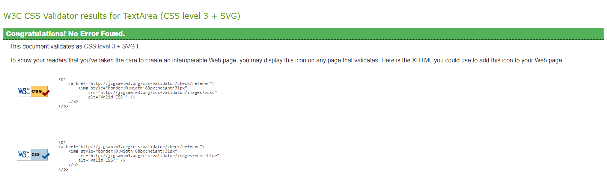
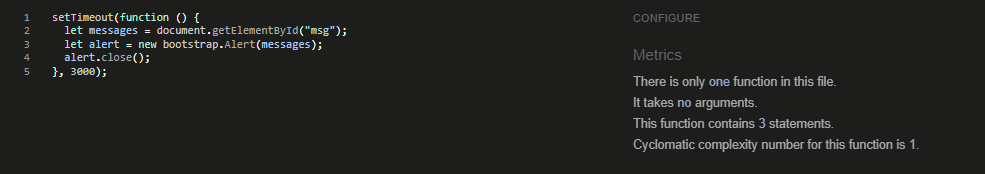
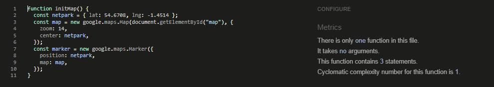

# Table of Contents
- [Validator Testing](#validator-testing)
  * [HTML](#html)
    + [Notes](#notes)
  * [CSS](#css)
  * [JavaScript](#javascript)
  * [Python](#python)
  * [Lighthouse](#lighthouse)
- [Browser and Device Testing](#browser-and-device-testing)
- [Manual Testing](#manual-testing)
- [Bugs](#bugs)

## Validator Testing

### HTML

The [Official W3C HTML Validator](https://validator.w3.org/) was used to check all html pages. All errors found were fixed.

HTML Validation Report

| Page                     | Logged Out    | Logged In - Analyst | Logged In - Senior |
|--------------------------|---------------|---------------------|--------------------|
| login.html               | Note 1        | N/A                 | N/A                |
| logout.html              | N/A           | Note 1              | Note 1             |
| signup.html              | Note 1        | N/A                 | N/A                |
| 400.html                 | Note 2 & 3    | N/A                 | N/A                |
| 403.html                 | N/A           | Note 3              | Note 3             |
| 404.html                 | Note 3        | N/A                 | N/A                |
| 500.html                 | Note 3        | N/A                 | N/A                |
| base.html                | Note 1        | Note 1              | Note 1             |
| index.html               | No errors     | No errors           | No errors          |
| contact_us.html          | No errors     | No errors           | No errors          |
| tracker.html             | N/A           | No errors           | No errors          |
| all_tracker.html         | N/A           | No errors           | No errors          |
| priority_tracker.html    | N/A           | No errors           | No errors          |
| add_batch.html           | N/A           | No errors           | No errors          |
| update_batch.html        | N/A           | N/A                 | No errors          |
| delete_batch.html        | N/A           | N/A                 | No errors          |
| material.html            | N/A           | N/A                 | No errors          |
| add_material.html        | N/A           | N/A                 | No errors          |
| update_material.html     | N/A           | N/A                 | No errors          |
| delete_material.html     | N/A           | N/A                 | No errors          |
| scheduler.html           | N/A           | Note 4              | Note 4             |
| all_scheduler.html       | N/A           | Note 4 & 5          | Note 4 & 5         |
| add_workload.html        | N/A           | No errors           | No errors          |
| update_workload.html     | N/A           | No errors           | No errors          |
| delete_workload.html     | N/A           | N/A                 | No errors          |
| all_delete_workload.html | N/A           | N/A                 | No errors          |
| analysts.html            | N/A           | N/A                 | No errors          |
| add_analyst.html         | N/A           | N/A                 | No errors          |
| update_analyst.html      | N/A           | N/A                 | No errors          |
| delete_analyst.html      | N/A           | N/A                 | No errors          |
| tests.html               | N/A           | N/A                 | No errors          |
| add_test.html            | N/A           | N/A                 | No errors          |
| update_test.html         | N/A           | N/A                 | No errors          |
| delete_test.html         | N/A           | N/A                 | No errors          |

HTML Validation Notes

#### Notes

- Note 1:
login.html, logout.html, signup.html and base.html all had a trailing slash.
The trailing slash was removed to fix the error.

- Note 2:
400.html had an extra `
` that was not required.
This was removed to fix the error.

- Note 3:
All 4 error pages had the heading of `<h3>Lab Boss</h1>`.
The closing tag was changed to `</h3>` to fix the error.

- Note 4:
The icon links and toggle card form were enclosed in `

` tags.
The `

` tags were changed to `

` tags to fix the error.

- Note 5:
Page contained `<strike></strike>` tags, which are obsolete.
To fix the error these tags were removed and CSS was added to line through the required text.

[Table Of Contents](#table-of-contents)

### CSS

The [Official W3C CSS Validator](https://jigsaw.w3.org/css-validator/) was used to check the style.css file. No errors were found.

CSS Validation Report

[Table Of Contents](#table-of-contents)

### JavaScript

[Jshint](https://jshint.com/) was used to check all JavaScript code. No errors were found.

Jshint Reports

[Table Of Contents](#table-of-contents)

### Python

The python code was checked using the PEP8 linter throughout the project. The linter detected numerous issues with the code relating to whitespace and lines being too long. These issues were fixed by deleting any whitespaces and changing the long lines to multi-line code. Any code flagged for these issues that was not written by me has not been changed.

[Table Of Contents](#table-of-contents)

### Lighthouse

All pages were run for Lighthouse validation on both desktop and mobile to assess performance and accessibility. Initial reports gave the images should be in webp format and 'aria-labels' were missing for icon buttons. These were fixed by converting the images to webp format and adding aria-labels to the icon buttons.
The Lighthouse report did give a warning for *'Background and foreground colors do not have a sufficient contrast ratio'*, the contrast was improved on the home page and the tracker table. This issue was ignored for the footer link to the logo attribute as the link is not an integral part of the site but a requirement for use of the logo hexagon.

After the updates given above the following scores were given:

Lighthouse Desktop Report

| Page                | Performance  | Accessibility | Best Practices  | SEO |
|---------------------|--------------|---------------|-----------------|-----|
| login               |              |               |                 |     |
| logout              |              |               |                 |     |
| signup              |              |               |                 |     |
| home                |              |               |                 |     |
| contact_us          |              |               |                 |     |
| tracker             |              |               |                 |     |
| all_tracker         |              |               |                 |     |
| priority_tracker    |              |               |                 |     |
| add_batch           |              |               |                 |     |
| update_batch        |              |               |                 |     |
| delete_batch        |              |               |                 |     |
| material            |              |               |                 |     |
| add_material        |              |               |                 |     |
| update_material     |              |               |                 |     |
| delete_material     |              |               |                 |     |
| scheduler           |              |               |                 |     |
| all_scheduler       |              |               |                 |     |
| add_workload        |              |               |                 |     |
| update_workload     |              |               |                 |     |
| delete_workload     |              |               |                 |     |
| all_delete_workload |              |               |                 |     |
| analysts            |              |               |                 |     |
| add_analyst         |              |               |                 |     |
| update_analyst      |              |               |                 |     |
| delete_analyst      |              |               |                 |     |
| tests               |              |               |                 |     |
| add_test            |              |               |                 |     |
| update_test         |              |               |                 |     |
| delete_test         |              |               |                 |     |

Lighthouse Mobile Report

| Page                | Performance  | Accessibility | Best Practices  | SEO |
|---------------------|--------------|---------------|-----------------|-----|
| login               |              |               |                 |     |
| logout              |              |               |                 |     |
| signup              |              |               |                 |     |
| home                |              |               |                 |     |
| contact_us          |              |               |                 |     |
| tracker             |              |               |                 |     |
| all_tracker         |              |               |                 |     |
| priority_tracker    |              |               |                 |     |
| add_batch           |              |               |                 |     |
| update_batch        |              |               |                 |     |
| delete_batch        |              |               |                 |     |
| material            |              |               |                 |     |
| add_material        |              |               |                 |     |
| update_material     |              |               |                 |     |
| delete_material     |              |               |                 |     |
| scheduler           |              |               |                 |     |
| all_scheduler       |              |               |                 |     |
| add_workload        |              |               |                 |     |
| update_workload     |              |               |                 |     |
| delete_workload     |              |               |                 |     |
| all_delete_workload |              |               |                 |     |
| analysts            |              |               |                 |     |
| add_analyst         |              |               |                 |     |
| update_analyst      |              |               |                 |     |
| delete_analyst      |              |               |                 |     |
| tests               |              |               |                 |     |
| add_test            |              |               |                 |     |
| update_test         |              |               |                 |     |
| delete_test         |              |               |                 |     |

[Table Of Contents](#table-of-contents)

### Browser and Device Testing

[Table Of Contents](#table-of-contents)

### Manual Testing

[Table Of Contents](#table-of-contents)

### Bugs

[Table Of Contents](#table-of-contents)
